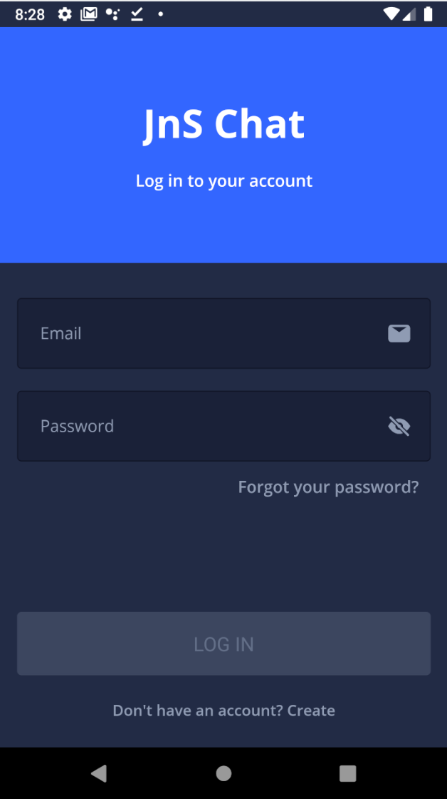

## JnS Chat

For my **JnS(Jump & Start)** series I created beautiful app demos using React Native.

This series intends to share a completed version of reference sample apps with various platform.
If you're intersted in it, Check my repositories.

## Supported Platforms: iOS, Android

The JnSChat is available for two platforms:

- iOS
- Android

## React Native App

React Native enables you to build native UIs for iOS, Android from a single, shared codebase. You can dive into app development with React Native by following [React Native Getting Started](https://facebook.github.io/react-native/docs/getting-started). This project exercises the following patterns and features:

- [React Native](https://www.npmjs.com/package/react-native)
- [React Navigation](https://www.npmjs.com/package/react-navigation)
- [React Native Localize](https://www.npmjs.com/package/react-native-localize)
- [I18n-JS](https://www.npmjs.com/package/i18n-js)
- [React Native Kitten](https://github.com/akveo/react-native-ui-kitten)
- [Typescript](https://www.npmjs.com/package/typescript)

## Screens

 

## Requirements

* [Android Studio](https://developer.android.com/studio)
* [Xcode](https://developer.apple.com/xcode/)
* [React Native Tools](https://facebook.github.io/react-native/)
